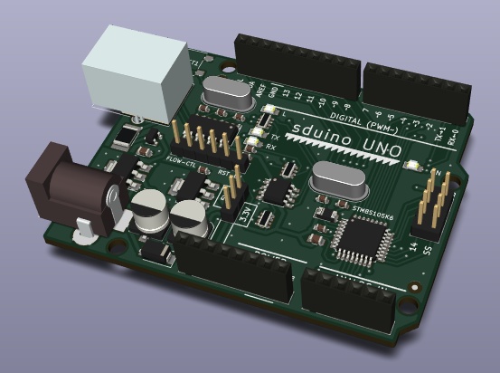

# sduino UNO

The __sduino UNO__ is an attempt at creating a mechanically and electrically Arduino-UNO-compatible development board based on the __STM8S105K6__ microcontroller.
Both, mechanical and electrical design are to a notable degree based on the [Arduino UNO board](https://store.arduino.cc/arduino-uno-rev3).

# Pin mapping

Number | UNO pin name | ATMEGA328 pin name | STM8S105K6 pin name
-------|--------------|--------------------|----------------------------------------
0      | IO0/RX       | PD0/RXD            | PD6/UART2_RX
1      | IO1/TX       | PD1/TXD            | PD5/UART2_TX
2      | IO2          | PD2/INT0           | PD7/TLI [TIM1_CH4]
3      | IO3          | PD3/INT1/OC2B      | PD2 (HS)/TIM3_CH1 [TIM2_CH3]
4      | IO4          | PD4/T0/XCK         | PD0 (HS)/TIM3_CH2 [TIM1_BKIN]/[CLK_COO]
5      | IO5          | PD5/T1/OC0B        | PD4 (HS)/TIM2_CH1 [BEEP]
6      | IO6          | PD6/AIN0/OC0A      | PD3 (HS)/TIM2_CH2/ADC_ETR
7      | IO7          | PD7/AIN1           | PD1 (HS)/SWIM
8      | IO8          | PB0/ICP1/CLKO      | PC1 (HS)/TIM1_CH1/UART2_CK
9      | IO9          | PB1/OC1A           | PC3 (HS)/TIM1_CH3
10     | IO10/~~SS~~  | PB2/NSS/OC1B       | PC4 (HS)/TIM1_CH4
11     | IO11/MOSI    | PB3/MOSI/OC2A      | PC6 (HS)/SPI_MOSI
12     | IO12/MISO    | PB4/MISO           | PC7 (HS)/SPI_MISO
13     | IO13/SCK     | PB5/SCK            | PC5 (HS)/SPI_SCK
14     | AD0          | PC0/ADC0           | PB0/AIN0 [TIM1_CH1N]
15     | AD1          | PC1/ADC1           | PB1/AIN1 [TIM1_CH2N]
16     | AD2          | PC2/ADC2           | PB2/AIN2 [TIM1_CH3N]
17     | AD3          | PC3/ADC3           | PB3/AIN3 [TIM1_ETR]
18     | AD4/SDA      | PC4/ADC4           | PB5/AIN5 [I2C_SDA]
19     | AD5/SCL      | PC5/ADC5           | PB4/AIN4 [I2C_SCL]
20     | AD6          | --                 | --
21     | AD7          | --                 | --
_22_   | AREF         | AREF               | PF4/AIN12
_23_   | _IO23_       | --                 | PC2 (HS)/TIM1_CH2
_24_   | _IO24/SS_    | --                 | PE5/SPI_NSS
--     | RESET        | NRESET             | NRST
--     | --           | PB6/TOSC1/XTAL1    | PA1/OSCIN
--     | --           | PB7/TOSC2/XTAL2    | PA2/OSCOUT

# Differences

The following paragraphs highlight the most important differences between Arduino UNO and sduino UNO.

## Mechanical

The gap between the upper socket strips has been reduced from 0.06 to 0.05 inches.
This should not significantly impact mechanical compatibility with Arduino UNO shields and increases the available radius around the center of the upper left M3 mounting hole from 2.286 to 2.54 millimeters, which should be just enough to fit in a standard M3 spacer (5mm wrench).

## Electrical

Most importantly, the sduino UNO can be switched between 5V and 3.3V operating voltage.
The RX and TX LEDs are connected to the RX and TX lines (IO pin 0 and 1, respectively) via 1k resistors, rather than to the USB interface chip.

## Functional

Like many Arduino UNO clones, the sduino UNO uses a CH340G USB to serial converter instead of an Atmega16U2 for communication with the host PC.
The USB interface Chip therefore cannot be repurposed as a coprocessor or keyboard/mouse simulator.

There is no analog comparator in the STM8S105K6 microcontroller and AREF is actually an additional analog input.
Its use as reference voltage for A/D conversion has to be imitated in software.
IO11 has no hardware PWM functionality for analog_write, IO8 and IO4 have.
IO2, AD0, AD1 and AD2 can be used as PWM outputs via alternate function mapping.

Likewise, IO10 does not serve as hardware-slave-select line for the SPI bus.
This, however, can mostly be overcome by software-emulation, because the STM8 allows for slave-select to be controlled in software, e.g. in an interrupt handler.
The actual slave-select line has been made available via an exra pin.

## Software

Unfortunately there is no C++ compiler available for the STM8 platform, yet.
The Arduino language along with the large pool of existing Arduino sketches can therefore not be used without modifications.

Fortunately there is the C-based [sduino library](https://github.com/tenbaht/sduino) that in fact inspired the creation of the sduino UNO and that this board borrows its name from.
By using the sduino library, the changes required to run many exsting Arduino sketches on an STM8 platform can be kept within manageable bounds.

Possibilities to bring C++ support to the STM8 platform are being evaluated.

# Copying

Even though the sduino UNO CAD files have been created from scratch and the design is not identical, to avoid legal ambiguity, the CAD files for the sduino UNO board are released under the same creative commons license as those of the Arduino UNO board:

This work is licensed under the Creative Commons Attribution-ShareAlike 2.5 Generic License. To view a copy of this license, visit http://creativecommons.org/licenses/by-sa/2.5/ or send a letter to Creative Commons, PO Box 1866, Mountain View, CA 94042, USA.
